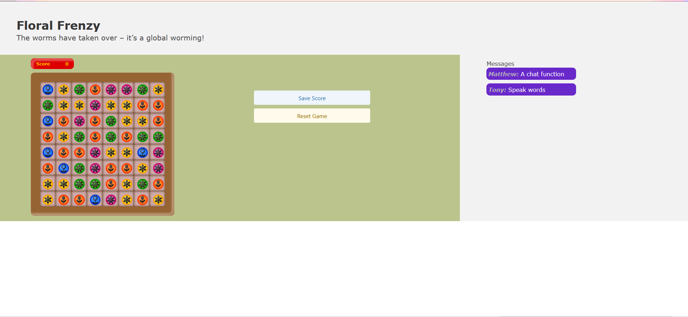

# Floral Frenzy
      
## [Description](#table-of-contents)
A match-3 game with an interactive chat and log-in functionality

Deployed Link
https://hidden-savannah-90090-89d1d2fd3177.herokuapp.com/

## Table-of-Contents
* [Description](#description)
* [Installation](#installation)
* [Usage](#usage)
* [License](#license)
* [Contributing](#contributing)
* [Tests](#tests)
* [FAQs](#faqs)
   
## [Installation](#table-of-contents)
`npm init`

`npm install`
   
## [Usage](#table-of-contents)
Run 

`mysql -u root -p`

Enter password when prompted

`source db/schema.sql`

`quit`

`npm run seed`
  
`npm start`
       
## [license](#table-of-contents)

Your repository is licensed under an mit open source license, so other people can contribute more easily.More information can be found by clicking this [link.](https://choosealicense.com/licenses/mit)

## [Contributing](#table-of-contents)
If you want to:
* Suggest a feature
* Report an issue
* Improve documentation
* Contribute to the code

Please reach out
   
GitHub [issues page](https://github.com/T0ny-Macaroni/Floral-Frenzy/issues) 
   
## [Tests](#table-of-contents)
No testing currently set
   
## [FAQs](#table-of-contents)
Match-3 game developed based on:
https://github.com/jdelak/match3JS

Contact Information:

[GitHub](https://github.com/T0ny-Macaroni) / Email: tonyguiliani3502@gmail.com